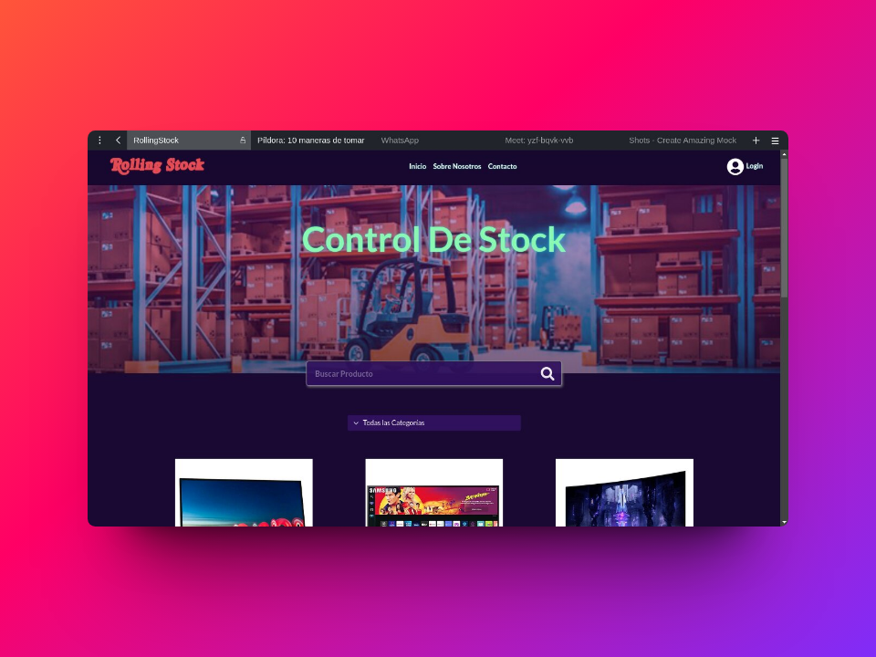

# RollingStock

## Sistema de control de stock.

RollingStock es un sistema que gestiona el stock de productos organizados por categorias, cuenta con un sistema de búsqueda y filtrado, gestión de usuarios y roles. Los usuarios comunes pueden ver todos los productos, realizar búsquedas de productos específicos, ver un detalle de cada producto o filtrarlos por categoria, tienen acceso a su página de perfil, y pueden enviar un correo al administrador del sistema usando el formulario de contacto. Los usuarios administradores ademas tienen acceso al dashboard de administración, donde pueden gestionar (agregar editar o eliminar) productos, usuarios y categorias, también cuentan con su pagina de perfil.
El sistema está desarrollado usando el stack MERN, la interfaz de usuario se realizo usando bootstrap 5 y es totalmente responsivo.

## Tecnologias

- React en el frontend
- Styles con React-Bootstrap
- NodeJS en el backend
- Express para el servidor backend
- MongoDB como bade de datos
- Mongoose para conectar el backend con la base de datos
- JWT para generar token y bcrypt para encriptar las contraseñas
- Axios para la conexion de frontend con el backend
- Deploy en netlify para el frontend y render para el backend
- Git and Github control de versiones

## Uso Backend

- Clonar el repositorio backend (https://github.com/martin-casares/control-stock-backend.git).

- Crear variables de enterno BASE_URL para la base de datos con mongodb atlas y SECRET_KEY para generar el token.

- Entrar a la carpeta de repositorio:

  `cd control-stock-backend`

- Instalar las dependencias:

  `npm install`

- Ejecutar el proyecto:

  `npm start`

### API Rutas

##### Productos

- **/api/products**

Esta ruta trae todos los productos guardados en la db, en formato json, utilizando el metodo http GET, todos los usuarios pueden acceder a ésta información.

- **/api/product-add**

Esta ruta agrega un nuevo producto a la db, utlizando el metodo http POST, el usuario debe estar registrado como usuario admin para poder acceder a éste metodo

- **/api/product/:id**

En ésta ruta se utiliza un metodo POST para editar los datos del producto, solo el usuario admin tiene acceso, se debe incluir el id del producto como parametro en la url, los datos se registran en la db.

- **/api/products/:id**

Esta ruta se utiliza para eliminar un producto, el id se producto se pasa como parametro en la url, los cambias se registran en la db, solo el admin tiene acceso.
Es un metodo http DELETE.

- **/api/products/category/:id**

Esta ruta sirve para filtrar productos por categoria, todos los usuarios tienen acceso. Se utiliza el metodo http GET.

#### Auth

- **/api/resiter**

En ésta ruta se realiza el registro de usuario, los datos deben ser enviados en formato json. Se utliliza en metodo http POST.

- **/api/login**

En ésta ruta se realiza el login, los datos deben ser enviados en formato json y el sistema devuelve un JWT para adminitrar la sesión se usuario. Se utliliza en metodo http POST.

#### users

- **/api/users**

Esta ruta trae todos los usuarios registrados en el sistema, solo el usuario admin tiene acceso. Se utliliza en metodo http GET.

- **/api/users/:id**

Esta ruta trae información de un usuario especifico. Se utliliza en metodo http GET.

- **/api/users/user-add**

Esta ruta se utiliza para crear un nuevo usuario, solo el usuario admin tiene acceso, es un metodo http POST.

- **/api/user/id**

Esta ruta utiliza un metodo http PUT para realizar la actualizacion de los datos del usuario, solo el admin tiene acceso.

- **/api/user/id**

Esta ruta utiliza el metodo http DELETE para eliminar un usuario, recibe como parametro el id del usuario a eliminar, solo el admin tiene acceso

- **/api/users**

## Uso Frontend

- Clonar el repositorio (https://github.com/martin-casares/control-stock-frontend.git)

- Entrar a la carpeta de repositorio:

  `cd control-stock-frontend`

- Instalar las dependencias:

  `npm install`

- Ejecutar el proyecto:

  `npm run dev``

* [Deploy en netlify](https://rollingstock.netlify.app)
